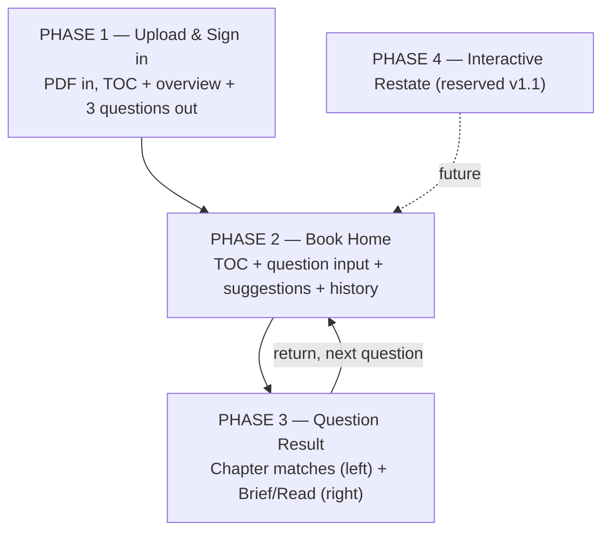

# Vibe Reading — Product Flow

## Type
Flowchart (stacked phase layers, English)

## Source
`docs/vibe-reading.md` §Solution — 4-phase question-driven flow (v2, 2026-04-24)

## Reader need
"After seeing this diagram, the reader understands the entire product flow: upload → book home (TOC + question) → question result (chapters + split-pane brief/read) → reserved interactive restate, and understands the product direction (no summary until the reader asks a question)."

## Mermaid sketch

## Layout

- 4 containers × h=125, gap=16, standard 680 width
- Phase 2 is the heart → `layer-key` accent (only one in the diagram)
- Right-corner `eyebrow-accent` punch on every container
- Footer: compression philosophy caption pair
- H = 80 (title) + 500 (4×125) + 48 (3×16) + 80 (footer) + 10 buffer = **718**

## Right-corner punches
- P1 → No summary yet
- P2 → Reader must ask first (accent ramp)
- P3 → AI maps, reader compresses
- P4 → Coming in v1.1
